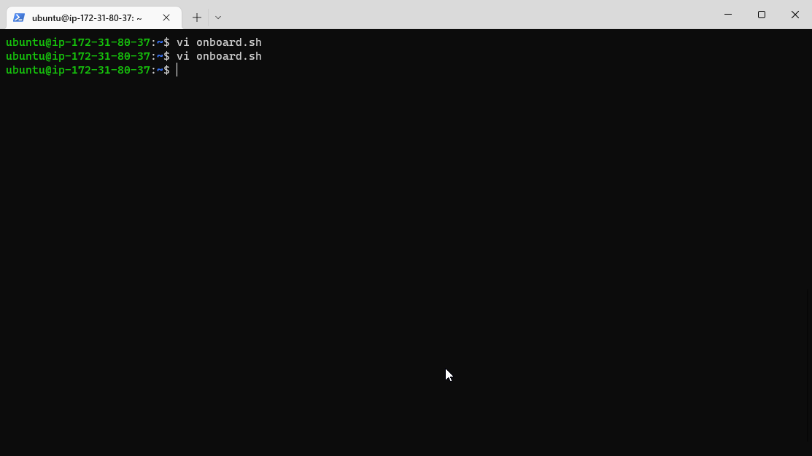
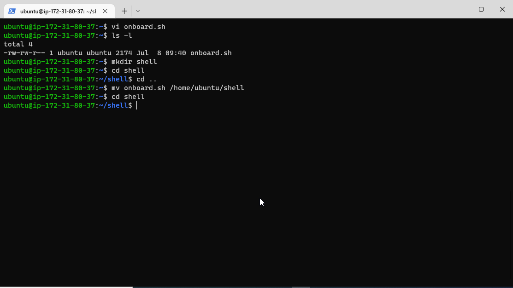
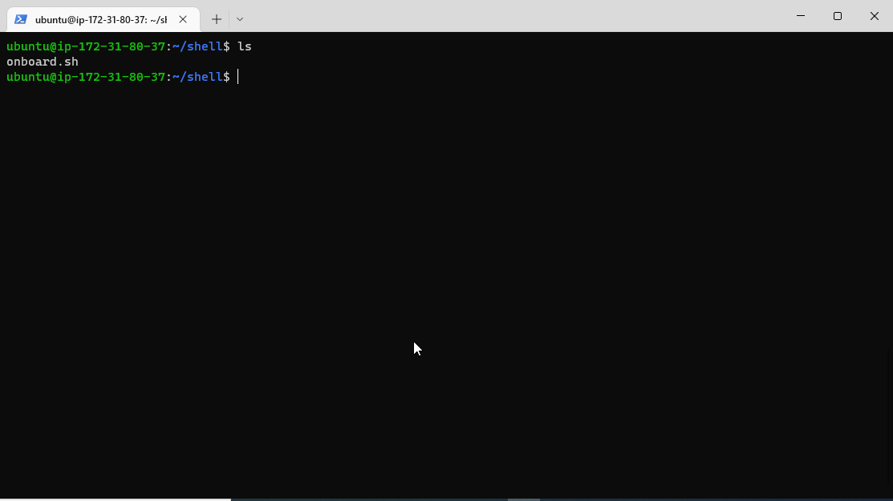
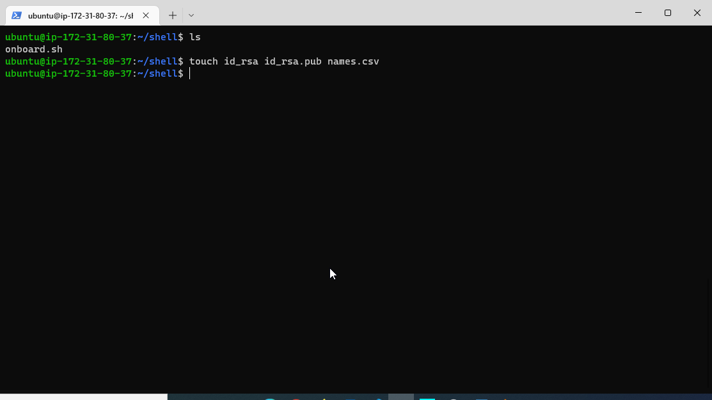
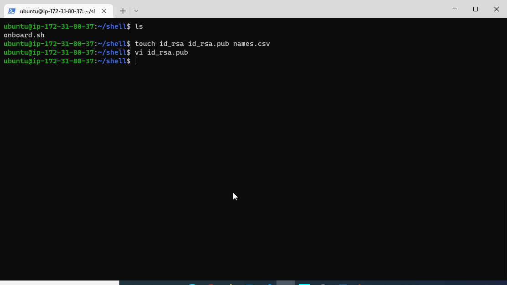
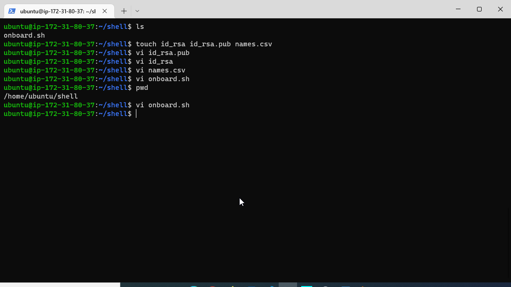
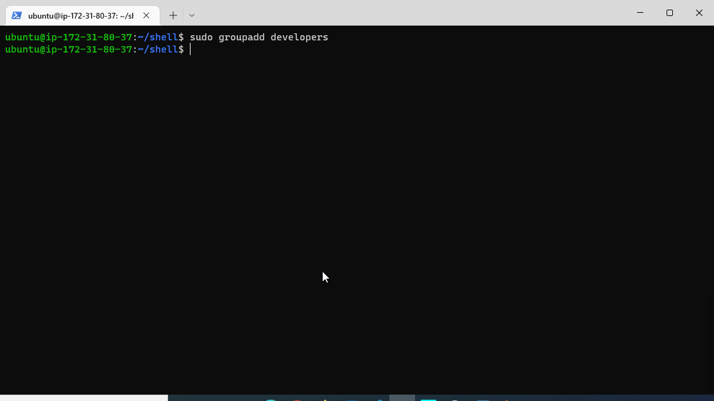
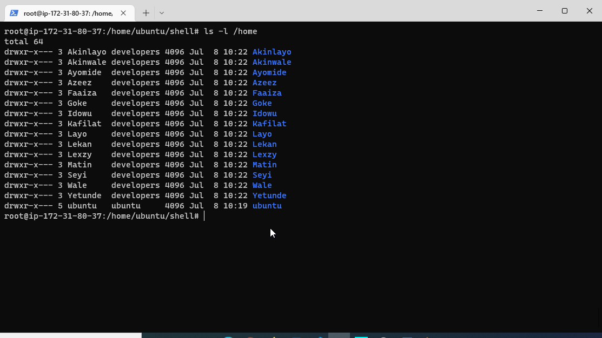
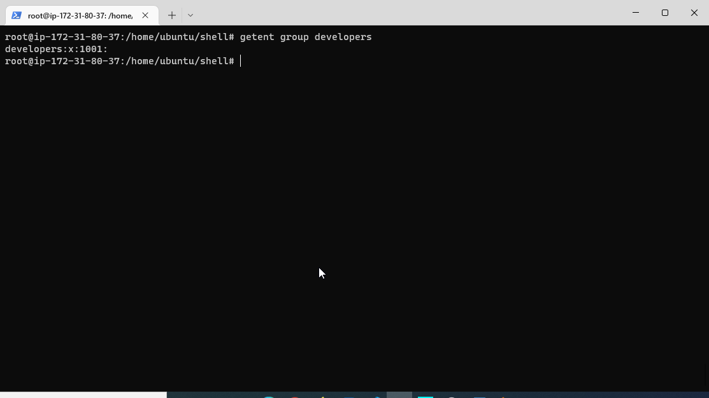

## AUX PROJECT 1: SHELL SCRIPTING
### How to automate some work using Shell Scripts
### In this project, I will onboard 16 new Linux users onto a server. I will Create a shell script that reads a csv file that contains the first name of the users to be onboarded. 

## Creating a Shell Script

`vi onboard.sh`

### The code in onboarding users Linux Shell was added and saved

### I make a directory 'Shell' and cd into the diectory

`mkdir Shell`
`cd shell`

### I move my onboading file into the shell directory

### ls into the shell derectory to confirm my onboarding file

`ls`

### I create a file for the public key 

`touch id_rsa.pub`

### I open the file using your favorite editor and paste in the public key

`vi id_rsa.pub`

### I create a file for your private key

`touch id_rsa`
`vi id_rsa`

### CHMOD onbaord file

### create developers group

#### all the 16 users added to developers group

### all the 16 developer added to developer group

